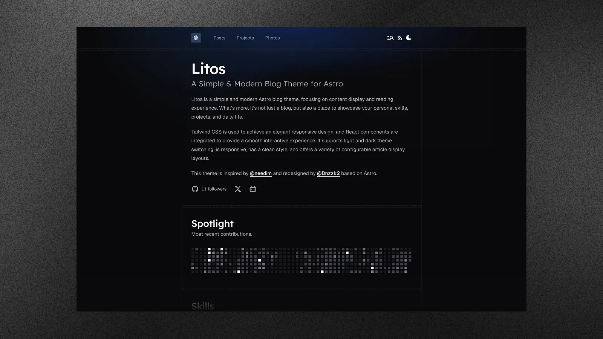

<div align="center">


**一个为开发者打造的现代、优雅、高性能博客主题。**

[English](./README.md) | **简体中文**

[在线演示](https://litos.vercel.app/) · [反馈问题](https://github.com/Spotren/spotren-sites/issues) · [功能建议](https://github.com/Spotren/spotren-sites/issues)

</div>

## 简介

ndEX Builder 是一个使用 **Astro**、**React** 和 **TailwindCSS** 精心打造的博客主题。它为开发者提供了一个简洁、专业且高度可定制的平台，用于展示作品、记录想法和分享摄影作品。

不同于传统主题，ndEX Builder 在保持极致性能的同时，注重视觉美感。它拥有流畅的动画效果、精致的设计系统以及丰富的内置组件，帮助你高效地打造个人品牌。



## 主要特性

- **现代架构** — 基于 Astro 5 实现极速性能，搭配 React 19 提供动态交互。
- **优雅设计** — 使用 TailwindCSS 4 精心打造的全响应式 UI。
- **文章** — 多种布局选项（紧凑式、封面图），支持丰富的 Markdown 语法。
- **项目** — 专属项目展示区域，支持标签筛选。
- **相册** — 精美的瀑布流布局，展示你的摄影作品。
- **技能展示** — 可视化配置的技术栈展示。
- **代码高亮** — 集成 Expressive Code，提供精美的语法高亮。
- **数学公式** — 支持 KaTeX 渲染数学公式。
- **评论系统** — 集成 Gitalk，基于 GitHub 的评论功能。
- **SEO** — 内置站点地图、robots.txt 和 Meta 标签支持。
- **数据分析** — 可配置 Vercount 和 Umami 分析服务。
- **暗色模式** — 原生支持明暗主题切换。

## 部署

一键部署你的 ndEX Builder 站点：

[](https://vercel.com/new/clone?repository-url=https://github.com/Spotren/spotren-sites)
[](https://app.netlify.com/start/deploy?repository=https://github.com/Spotren/spotren-sites)

## 快速开始

### 环境要求

- **Node.js**（v18 或更高版本）
- **pnpm**（推荐的包管理器）

### 安装步骤

1.  **克隆仓库**

    ```bash
    git clone https://github.com/Spotren/spotren-sites.git
    cd spotren-sites/ndEX-builder
    ```

2.  **安装依赖**

    ```bash
    pnpm install
    ```

3.  **启动开发服务器**

    ```bash
    pnpm dev
    ```

    站点将运行在 `http://localhost:4321`。

## 配置

主要配置文件位于 `src/config.ts`。

### 站点设置
```typescript
export const SITE: Site = {
  title: 'ndEX Builder',
  description: '你的站点描述',
  website: 'https://your-domain.com',
  author: '你的名字',
  // ...其他设置
}
```

### 功能开关
```typescript
export const SKILLSSHOWCASE_CONFIG = {
  SKILLS_ENABLED: true,
  // ...
}

export const GITHUB_CONFIG = {
  ENABLED: true,
  // ...
}
```

### 导航
通过 `HEADER_LINKS` 和 `FOOTER_LINKS` 管理页头和页脚的链接。

## 脚本命令

| 命令 | 说明 |
| :--- | :--- |
| `pnpm dev` | 启动本地开发服务器 |
| `pnpm build` | 构建生产环境站点 |
| `pnpm preview` | 本地预览生产构建 |
| `pnpm format` | 使用 Prettier 格式化代码 |
| `pnpm check` | 运行 Astro 诊断检查 |

## 许可证

基于 MIT 许可证分发。详见 [MIT LICENSE](LICENSE)。

## Star 趋势

<a href="https://www.star-history.com/#Spotren/spotren-sites&type=date&legend=top-left">
 <picture>
   <source media="(prefers-color-scheme: dark)" srcset="https://api.star-history.com/svg?repos=Spotren/spotren-sites&type=date&theme=dark&legend=top-left" />
   <source media="(prefers-color-scheme: light)" srcset="https://api.star-history.com/svg?repos=Spotren/spotren-sites&type=date&legend=top-left" />
   
 </picture>
</a>

---

<p align="center">
made with 💗 by <a href="https://github.com/Dnzzk2">Dnzzk2</a> !
</p>
